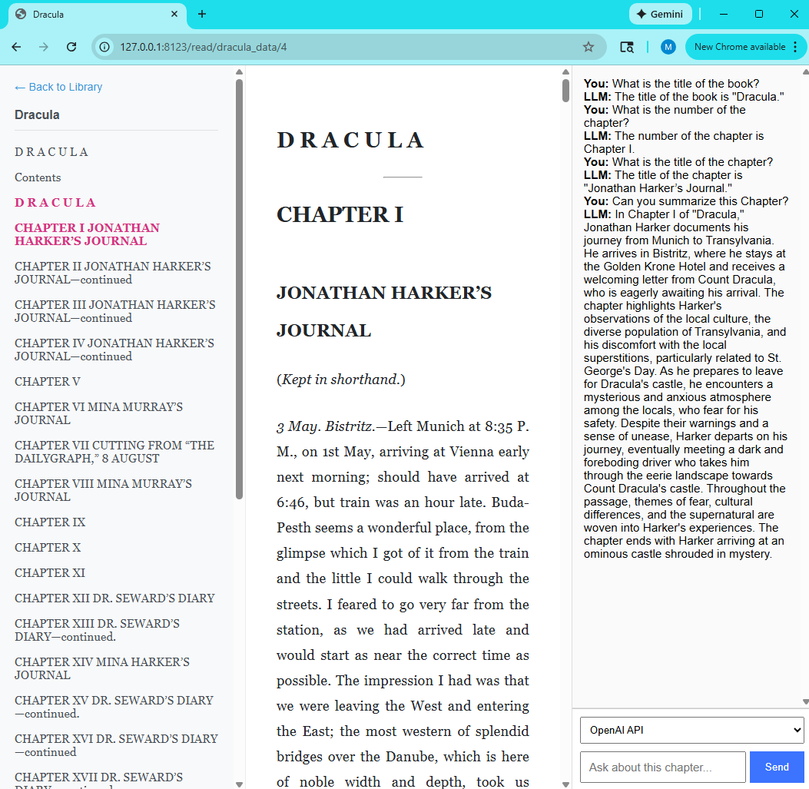
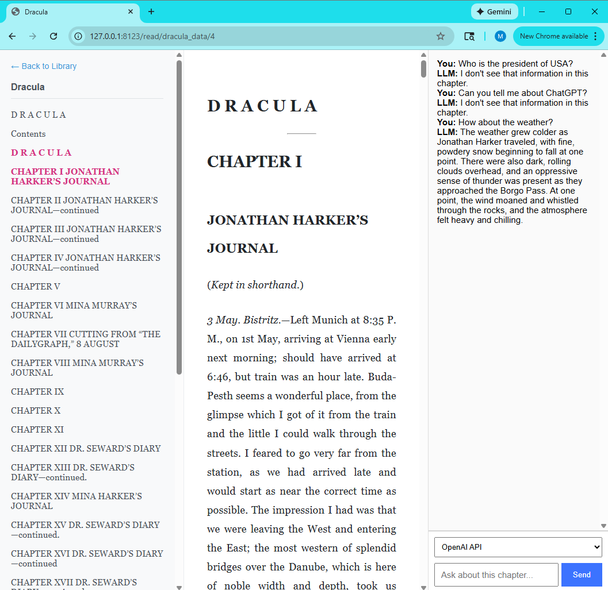

# reader3

A lightweight, self-hosted EPUB reader with a built-in **AI chat window**. 
Read any EPUB one chapter at a time, and ask a local LLM (Ollama) or the OpenAI API questions about the **current chapter**—no copy/paste required.

Inspired by Karpathy’s idea of “reading books with LLMs” can be found in this repository "karpath/reader3".  this project is intentionally simple, hackable, and easy to modify with the help of any LLM.

### Final UI
Below is how the reader appears with integrated chat window.. <br>

Response with questions in the chapter...<br>



Response with questions not in the chapter..<br>



---

## Features

- 📖 Clean, chapter-based EPUB reader  
- 💬 Integrated **chat window** on the right  
- 🤖 Supports **local LLMs (Ollama)** or **OpenAI GPT models**  
- 📘 Automatically sends the **current chapter text** as context  
- 🔒 LLM is **restricted to chapter content only**  
- 🧹 `.env` support with `python-dotenv`  
- 🗂️ Simple library system (`*_data` folders)

--------

## Usage

### 1. Install dependencies
Install all the required dependencies of the file
```bash
pip install -r requirements.txt
```
### 2. Process an EPUB
Download an EPUB (e.g., Dracula from Project Gutenberg) and process it. Place this file in the project folder
```bash
python reader3.py dracula.epub
```
This creates a folder:
```bash
dracula_data/
  ├── book.pkl
  └── images/
```
Each `*_data` folder becomes a book in your library. 
### 3. Run the server
```bash
python server.py
```
visit: http://localhost:8123/
You'll see local libary and can open any book
### 4. Enable OpenAI
Create a `.env` file in your project folder with below line defining your open ai key. 
```
OPENAI_API_KEY=your_key_here
```
If omitted, only local LLM model is available
